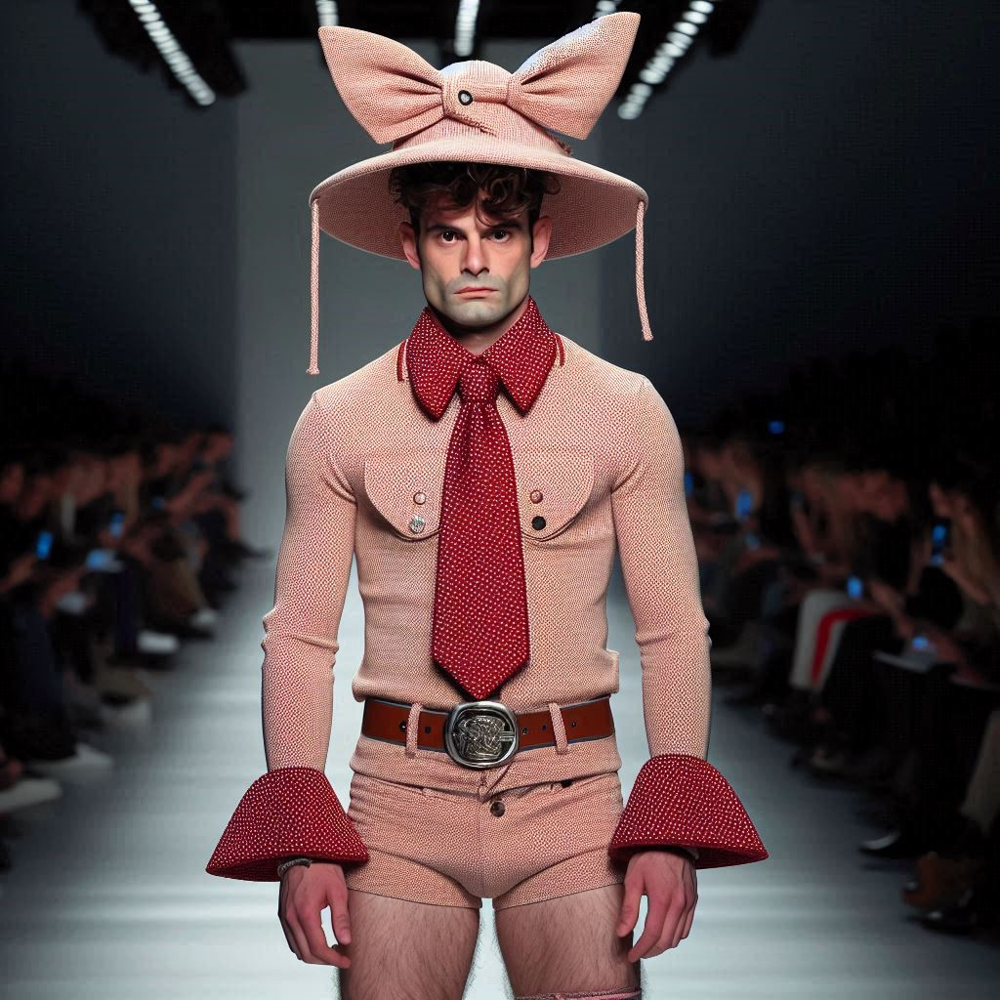
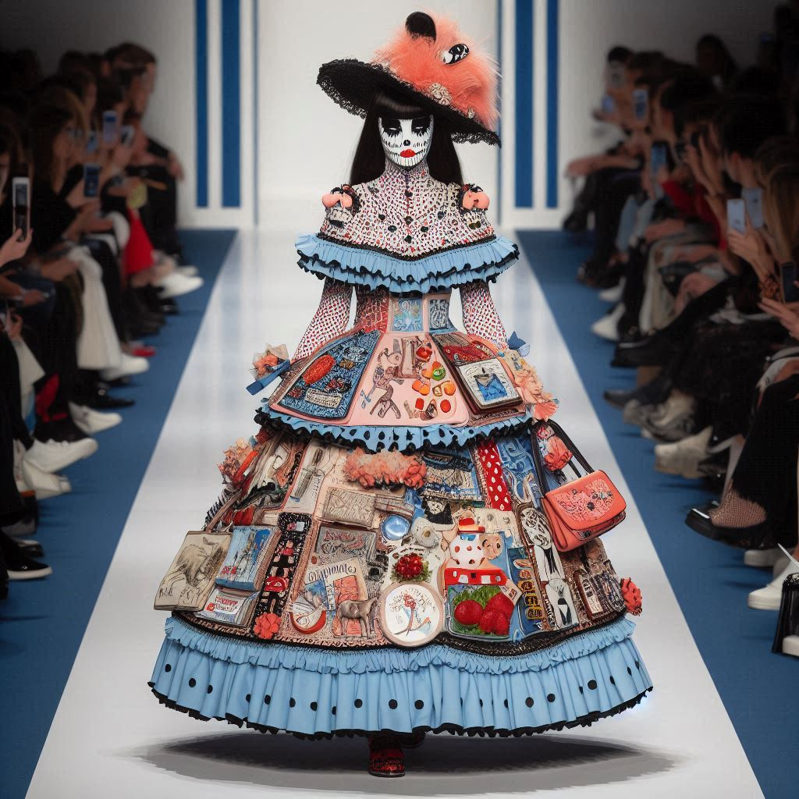
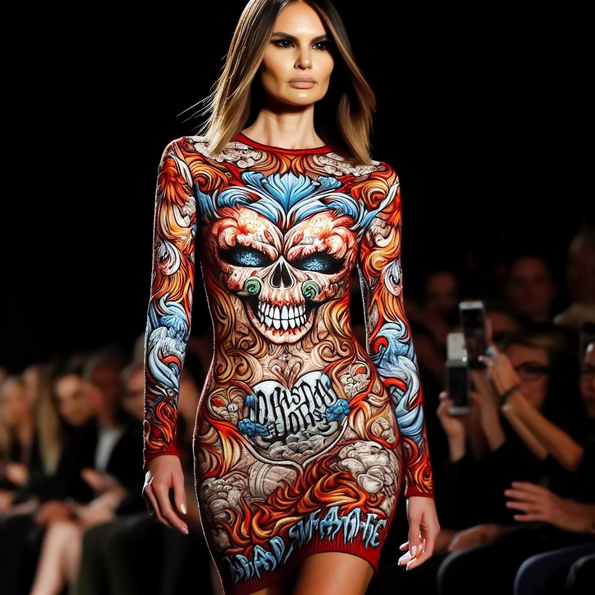
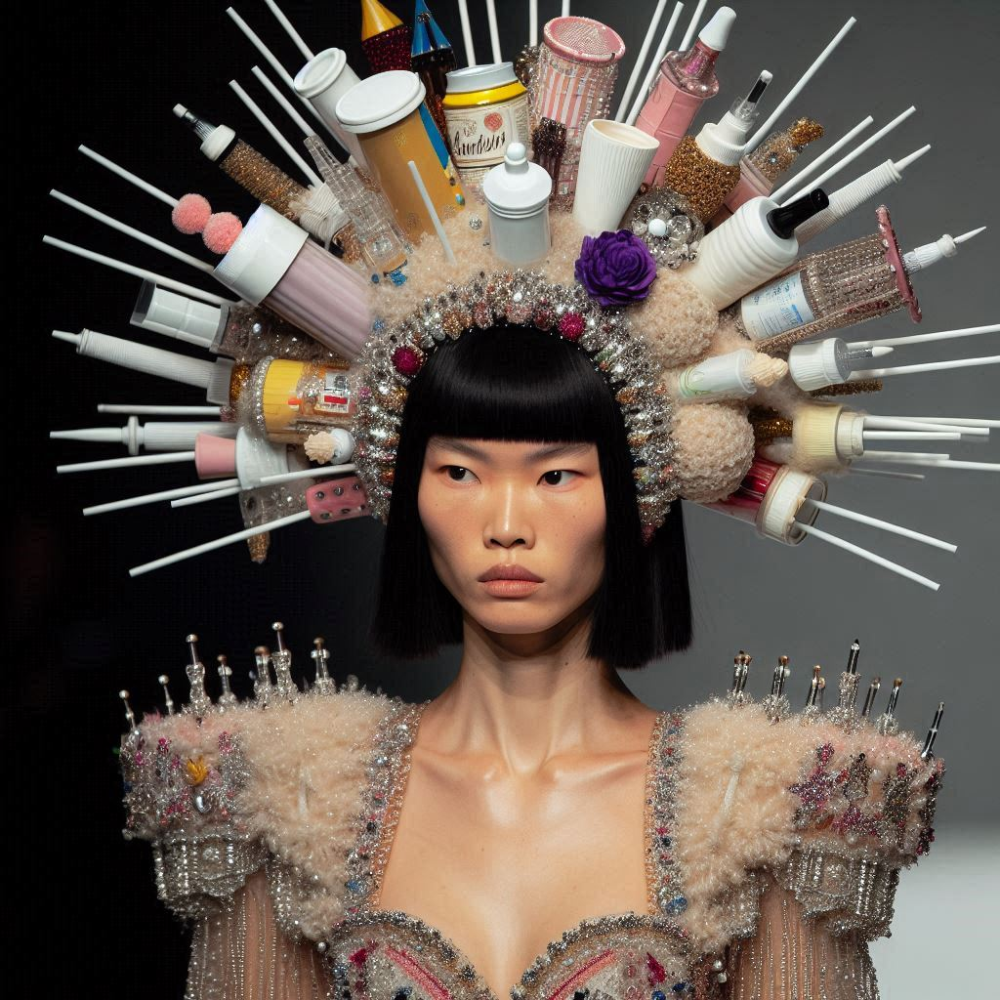

Haute couture is not just for the elite—it is the heartbeat of fashion, inspiring creativity, pushing boundaries, and shaping the future of style for everyone. Its artistry and innovation trickle down, influencing everyday wear and empowering self-expression across all walks of life. It is a universal language of boldness, imagination, and individuality.

<!--more-->

Camp-cowboy couture in candy pink—oversized bow, power tie, and engineered proportions—winking as it rewrites dress codes. Behind the irony is a razor‑sharp message about performed authority, and it’s much smarter than it looks.

A theatrical couture tableau: a doll‑like silhouette layered with hand‑appliquéd storybook panels, mixed‑media trinkets and meticulously tailored ruffles — a masterclass in craftsmanship that turns nostalgic imagery into a smart, maximalist narrative.

It's a true testament to the designer's ability to blend fantasy with fashion, resulting in a wearable art piece that commands attention.

A second‑skin, long‑sleeve mini in stretch jersey with engineered, tattoo‑style trompe‑l’oeil—impeccable placement and body‑mapping that sculpt the torso.  
Editorially potent, but the skull-forward graphic risks novelty; the concept leans more on print than on cut.

A head-turning, cosmetics-adorned extravaganza. The model's headdress, a riotous assembly of glue sticks, pom-poms, and party hats, is a maximalist's dream.

But beneath the dazzle the message is anything but subtle. 
Love it or hate it, this dress will be talked about – but is that enough to elevate it to true haute couture?

