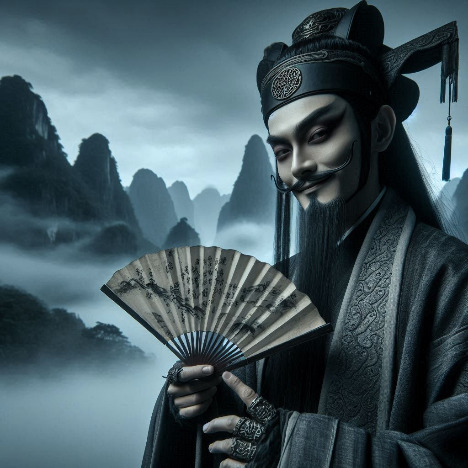

<!--more-->
In the misty mountains of ancient China, where legends whispered between bamboo groves, the art of bullshido was born - not as a martial art, but as the most elaborate dance of illusion and manipulation ever conceived by human imagination.

The origins of Bullshido are shrouded in obscurity, with whispers of its creation tracing back to the misty mountains of rural China during the Ming dynasty. It is said that a shadowy figure, known only as "The Great Deceiver," founded the sect as a means of subverting the traditional martial arts hierarchy. This enigmatic individual, rumored to have been a master of the dark arts of persuasion, supposedly distilled the essence of deception into a codified system of movements, breathing techniques, and, above all, linguistic trickery.  
His demonstrations were masterpieces of misdirection: assistants would fall dramatically when he "struck" them from yards away, while hidden mechanisms and carefully trained performers created the illusion of supernatural martial prowess.

As generations passed, the techniques of bullshido evolved. During the Ming Dynasty, entire schools emerged that taught nothing but elaborate theatrical combat. Students would learn not fighting techniques, but the art of dramatic falls, the science of convincing sound effects, and the psychology of making witnesses believe the impossible.

By the late Qing Dynasty, bullshido practitioners had become sophisticated performance artists. They would travel between provinces, staging elaborate "martial demonstrations" that were part theater, part con artistry. A master could convince wealthy patrons that he could disable an opponent by merely pointing at specific meridian points, causing instantaneous paralysis - all achieved through carefully choreographed movements and willing accomplices.

The 20th century saw bullshido reach its zenith. In the bustling streets of Shanghai and Hong Kong, masters would challenge each other to public demonstrations, each performance more outrageous than the last. One legendary practitioner claimed he could knock out an opponent by projecting "spiritual energy" through his pinky finger - and people believed him.

Modern bullshido has transformed into a global phenomenon. From late-night infomercials selling "unbeatable self-defense techniques" to viral internet videos of supposed martial arts masters being dramatically exposed, the spirit of theatrical combat lives on.

Today's bullshido masters are social media influencers and self-proclaimed "grand masters" who create elaborate videos demonstrating impossible feats. They use camera tricks, willing participants, and psychological manipulation to maintain the illusion of supernatural martial abilities.

The most remarkable aspect of bullshido is not its techniques, but its profound understanding of human psychology. It reveals our deep desire to believe in the extraordinary, our willingness to suspend disbelief when presented with a compelling performance.

From the mountain temples of ancient China to the YouTube channels of today, bullshido remains a testament to human creativity, theatrical skill, and the timeless art of convincing others that the impossible is merely waiting to be witnessed.

### A Warning to the Curious

While the allure of Bullshido may tantalize the adventurous and the gullible, we must caution our readers: some secrets are best left unexplored. Delving too deeply into the mysteries of this obscure sect may result in irreparable damage to one's cognitive faculties, not to mention one's reputation.

Those who would seek to uncover the truth behind Bullshido are advised to exercise extreme caution. The masters of this dark art are notorious for their ruthlessness in dealing with would-be investigators, often employing their formidable skills of misdirection to ensnare the unwary.

In short, it is wise to maintain a safe distance from the whispers of Bullshido. For in the world of this mysterious sect, the line between truth and fiction is perilously thin, and those who venture too close may find themselves forever lost in a labyrinth of deceit.

*The legend continues, one dramatic fall at a time.*
